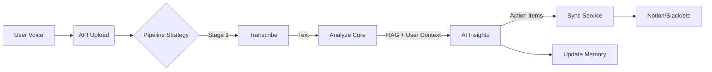

# VoiceBrain

VoiceBrain is an advanced voice-first AI agent that captures, transcribes, analyzes, and organizes your voice notes. It features an adaptive memory system, Retrieval-Augmented Generation (RAG) for context-aware analysis, and integrations with popular tools (Notion, Google Calendar, Slack, etc.).

## 🚀 Key Features

*   **Voice Pipeline**: High-performance audio transcription (AssemblyAI/DeepSeek) and processing.
*   **Adaptive Memory (ENA-like)**:
    *   **Short-Term**: Redis-based active context (last ~5 actions).
    *   **Medium-Term**: Vector search (embedding-based) + 1-hop graph traversal.
    *   **Long-Term**: Summarized, high-importance knowledge stored in PostgreSQL.
*   **Hierarchical Analysis**: Analyses notes in the context of your Identity, Preferences, and Past History.
*   **Integration Ecosystem**: Bi-directional sync with Notion, Todoist, Google Calendar, Slack, and more.
*   **Cross-Platform**: Accessible via Web (React/Vite), Desktop (Electron), and Telegram Bot.

## 🏗️ Architecture Overview

The system follows a microservices-lite architecture:

1.  **Backend (FastAPI)**: Core REST API, handling auth, file uploads, and serving requests.
2.  **Pipeline Orchestrator**: Manages the lifecycle of a note:
    `Transcribe -> Analyze (AI) -> Sync (Integrations)`
3.  **Workers (Celery)**: Async task processing for CPU-intensive jobs (transcription, heavy analysis).
4.  **Storage**:
    *   **PostgreSQL**: Persistent data (Users, Notes, Vectors).
    *   **Redis**: Caching, Rate Limiting, Celery Broker, Short-Term Memory.
    *   **S3/MinIO**: Object storage for audio files.

### Pipeline Flow



## 🛠️ Setup & Run

### Prerequisites
*   Docker & Docker Compose
*   Python 3.11+ (for local dev)

### Quick Start (Docker)

1.  **Clone the repository**:
    ```bash
    git clone https://github.com/kokhanandreyy-collab/voicebrain.git
    cd voicebrain
    ```

2.  **Environment Configuration**:
    Copy `.env.example` to `.env` and fill in API keys (OpenAI, DeepSeek, AssemblyAI, Postgres credentials).

3.  **Run with Docker Compose**:
    ```bash
    docker-compose up --build -d
    ```
    *   API will be available at `http://localhost:8000`.
    *   Docs at `http://localhost:8000/docs`.

### Local Development

1.  **Backend**:
    ```bash
    cd backend
    pip install -r requirements.txt
    uvicorn app.main:app --reload
    ```

2.  **Celery Worker**:
    ```bash
    celery -A app.celery_app worker --loglevel=info
    ```

## 📚 API Documentation

Interactive Swagger documentation is auto-generated and available at:
*   **Swagger UI**: `/docs`
*   **ReDoc**: `/redoc`

## 🧠 Memory System Details

VoiceBrain utilizes a hierarchical memory structure inspired by ENA (Evolving Network Architecture):

*   **Identity Core**: A summarized profile of the user (Bio, Goals, constraints) injected into every prompt.
*   **Adaptive Buffer**: Short-term interactions tracked in Redis to maintain conversational continuity.
*   **Vector Store**: Notes are embedded (using OpenAI/DeepSeek embeddings) for semantic retrieval.
*   **Reflection Loop**: A nightly background task reviews daily activities to consolidate long-term memories and update the Identity Core.

## 🤝 Contributing

See `CONTRIBUTING.md` for guidelines.

## 📄 License

MIT
